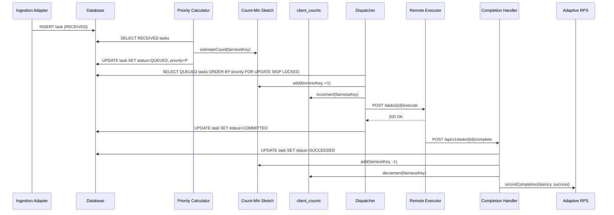

# Design Document: Equalix Micronaut — Eventually Fair Weighted Queue

**Version 1.0**

This document describes the design of the Equalix Micronaut port: the Count-Min
Sketch (CMS) fairness mechanism, in-flight slot management, adaptive RPS
throttling, sequential execution mode, and the Watchdog reconciliation loop.
The scheduling semantics are identical to the Spring Boot oracle by
construction; this document focuses on the Micronaut-specific implementation
and the framework mapping.

---

## 1. Introduction

### 1.1 The problem: fair scheduling under multi-tenant load

Imagine a SaaS platform where multiple tenants submit asynchronous processing
jobs — image transcoding, report generation, data exports. Each tenant is
assigned a **fairness key** (e.g. a tenant ID, customer ID, or project ID) that
identifies the logical group for which fairness is enforced.

**The naïve FIFO approach** puts every job in a single queue sorted by arrival
time. This works until tenant A submits 10,000 jobs while tenant B submits 1.
Tenant B waits behind all of tenant A's work — even though tenant A is already
monopolizing the system. Arrival order alone is not a fairness policy.

**The SQL `COUNT(*)` approach** attempts to fix this by counting how many tasks
each fairness key currently has in flight and deprioritizing keys with many
active tasks. This is correct, but the cost is steep. Every scheduling decision
runs `SELECT COUNT(*) ... GROUP BY fairness_key` against potentially millions of
rows. At 10,000 ingested tasks per second across hundreds of tenants, this
aggregate query dominates database load and caps effective throughput.

**Equalix's solution** replaces the count query with a
[Count-Min Sketch](https://en.wikipedia.org/wiki/Count%E2%80%93min_sketch) (CMS) —
a probabilistic in-memory structure that answers "how many tasks does this
fairness key have in flight?" in O(1) time using fixed memory (~2.6 MB with the
default 65536×5 sketch). Combined with a **virtual-time priority algorithm** that
automatically penalizes fairness keys with many in-flight tasks and an
**Adaptive RPS controller** that throttles dispatching when the downstream
executor is under stress, Equalix provides fair, high-throughput, resilient
scheduling across any number of tenants.

### 1.2 Terminology

- **Fairness key** — a string that identifies a logical group for which fairness
  is enforced. All scheduling decisions are made at the fairness-key level.
- **Weight** — a positive decimal assigned to a task (default 1.0). Higher weight
  receives a larger share of dispatch slots (`priority` divides the in-flight
  penalty by weight).
- **Virtual time / priority** — a computed timestamp-based value that penalizes
  fairness keys with many in-flight tasks, ensuring they yield scheduling slots
  to lighter keys.
- **In-flight** — a task that has been dispatched to a worker but not yet
  completed (statuses `DISPATCHED` or `COMMITTED`).
- **Eventually fair** — the fairness guarantee holds over a sliding window
  rather than at every instant. See §9.4.

### 1.3 Goals

- **Fairness**: proportional processing across fairness keys, weighted by task
  weight.
- **High throughput**: designed for the 10,000+ RPS range without database
  aggregate queries on the hot path.
- **Adaptive**: dynamic throttling based on remote executor latency and error
  rate.
- **Resilient**: retry, timeout, and reconciliation cover crashes and missed
  callbacks.
- **Payload-agnostic**: tasks carry opaque binary payloads; the queue
  interprets only scheduling metadata.

---

## 2. System overview

- **Ingestion** — REST and Kafka adapters accept messages and persist them as
  `RECEIVED` with the fairness key, weight, and payload.
- **Priority calculation** — a scheduled job reads batches of `RECEIVED` tasks,
  asks the CMS for each fairness key's in-flight count, reserves a persistent
  weighted virtual finish tag, computes
  `priority = finishTag + (inFlightCount × penaltyFactor / weight)`, and
  transitions tasks to `QUEUED`.
- **Dispatch** — a scheduled dispatcher selects `QUEUED` tasks ordered by
  priority, applies an optional hard quota per fairness key, and moves selected
  tasks to `DISPATCHED` while incrementing CMS and `client_counts`.
- **Remote execution** — the executor adapter fires the task at the remote
  system. Completion arrives via a webhook.
- **Completion** — the completion handler sets the terminal status, decrements
  CMS and `client_counts`, and feeds the Adaptive RPS controller.
- **Adaptive RPS** — monitors remote executor latency and error rate; adjusts the
  dispatch RPS and the penalty factor used by priority calculation.
- **Watchdog** — every 5 minutes, reconciles `client_counts` against the actual
  task table and rebuilds the CMS from the corrected snapshot.

---

## 3. Component interaction — sequence diagram



---

## 4. Architecture (hexagonal)

- **Domain core**: `Task`, `TaskStatus`, `ClientCounts`, `ClientSequenceState`,
  use cases, and scheduling services. Pure Java — no Micronaut, JPA, or HTTP
  imports.
- **Incoming ports**: `TaskIngestionPort`, `TaskCompletionPort`,
  `TaskManagementPort`.
- **Outgoing ports**: `TaskRepositoryPort`, `ClientCountsRepositoryPort`,
  `ClientSequenceStateRepositoryPort`, `CMSProviderPort`, `RemoteExecutorPort`,
  `PerformanceMonitorPort`.
- **Driving adapters**: REST controllers, Kafka consumer, scheduled jobs
  (priority calc, dispatcher, watchdog, sequential dispatcher, block/passthrough
  recovery).
- **Driven adapters**: PostgreSQL (Micronaut Data JPA + Flyway), local CMS
  (in-memory) or distributed CMS (Redis via Lettuce), HTTP remote executor (JDK
  `HttpClient`), Micrometer metrics.

### 4.1 Framework mapping (Spring oracle → Micronaut)

| Oracle (Spring) | This port (Micronaut) |
|---|---|
| `@Service` / `@Component` | `@Singleton` (+ explicit `@Inject` ctors) |
| `@Transactional` | `io.micronaut.transaction.annotation.Transactional` |
| `@ConfigurationProperties` | `@ConfigurationProperties` (+ `@Introspected` on nested POJOs) |
| `@Scheduled` + ShedLock | `@Scheduled` (**no distributed lock** — named out) |
| `WebClient` (Reactor) | JDK `HttpClient.sendAsync`, pinned HTTP/1.1 |
| `StringRedisTemplate` | Lettuce `StatefulRedisConnection` |
| Spring Kafka + `Acknowledgment` | `@KafkaListener`, offset commits after return |
| `TransactionSynchronizationManager` | Hibernate `ActionQueue` completion process |

---

## 5. Components and responsibilities

### 5.1 Ingestion adapters

REST (`TaskIngestionController`) and Kafka (`TaskIngestionKafkaConsumer`)
accept messages, validate metadata, and delegate to `CreateTaskUseCase`. A new
task is persisted as `RECEIVED` with no priority — priority calculation is
deferred to keep ingestion fast. Sequential tasks also `findOrCreate` a
`client_sequence_state` row so the first task of a key can dispatch.

### 5.2 Task repository (PostgreSQL)

Table `tasks`:

| Column                 | Type           | Notes                                                         |
|------------------------|----------------|---------------------------------------------------------------|
| `id`                   | UUID PK        |                                                               |
| `fairness_key`         | VARCHAR(255)   | Identifies the logical group                                  |
| `weight`               | DECIMAL(10,4)  | Default 1.0, `CHECK (weight > 0)`                             |
| `status`               | ENUM           | RECEIVED → QUEUED → DISPATCHED → COMMITTED → SUCCEEDED/FAILED/TIMEOUT |
| `priority`             | BIGINT NULL    | Virtual finish tag + in-flight pressure; null until QUEUED    |
| `virtual_finish`       | DOUBLE NULL    | Weighted virtual finish tag; null until QUEUED                |
| `payload`              | BYTEA          | Opaque binary                                                 |
| `created_at`           | TIMESTAMPTZ    |                                                               |
| `updated_at`           | TIMESTAMPTZ    | DB-assigned by trigger on every write                         |
| `completed_at`         | TIMESTAMPTZ    | Set on final states                                           |
| `retry_count`          | INT            |                                                               |
| `last_error`           | TEXT           |                                                               |
| `result`               | BYTEA          | Stored on completion for sequential passthrough               |
| Sequential columns     |                | `sequence_number`, `depends_on_task_id`, `is_sequential`, `requires_previous_result` |
| `version`              | BIGINT         | Optimistic locking                                            |

Indexes: `(status, priority)` for the dispatcher, `(status, created_at)` for
anti-starvation and cleanup, `(fairness_key, created_at)` for per-key lookups,
partial `(fairness_key) WHERE status IN ('DISPATCHED','COMMITTED')` for Watchdog
reconciliation, partial `(updated_at) WHERE status IN ('DISPATCHED','COMMITTED')`
for the timeout sweep, plus the sequential and hierarchical indexes.

`updated_at` is owned by the database: a `BEFORE INSERT OR UPDATE` trigger
stamps it from the DB clock on every write. Application code must not set it.

### 5.3 `client_counts` — durable in-flight counter

| Column            | Type                       |
|-------------------|----------------------------|
| `fairness_key`    | VARCHAR(255) PK            |
| `in_flight_count` | INT NOT NULL DEFAULT 0     |
| `updated_at`      | TIMESTAMPTZ                |

The dispatcher increments this atomically on every dispatch; the completion
handler decrements using `GREATEST(0, in_flight_count - 1)`. It is the durable
source of truth for hard quota enforcement and Watchdog reconciliation.

### 5.4 Count-Min Sketch

Two adapters implement `CMSProviderPort`:

- `CountMinSketchAdapter` — local in-memory sketch (positive and negative
  deltas). Default.
- `RedisCMSAdapter` — distributed sketch stored in Redis via Lettuce. Selected
  via `app.queue.cms.mode=redis`. Recommended when running 3+ instances with
  strict cross-instance fairness requirements. See §7.7.

Both adapters are wrapped in `TransactionAwareCmsProvider`. Inside a
transaction, `add` only buffers the delta; the net deltas are applied after
commit and discarded on rollback. A rolled-back dispatch or completion
therefore leaves the sketch unchanged.

Both adapters map a key to its cells with `CmsKeyHasher`: a 64-bit hash of the
key's UTF-8 bytes, mixed per row. When the application is ready,
`CmsWarmUpListener` rebuilds the sketch from in-flight tasks, so a restarted
instance does not start empty. A shared Redis sketch is rebuilt the same way,
as by a watchdog run.

### 5.5 Priority calculator

Scheduled every `app.queue.priority-calc-interval` (default 100 ms). For a
batch of `RECEIVED` tasks:

```
V             = scheduler_virtual_clock.virtual_time             -- read once per batch
finishTag     = max(client_virtual_time.virtual_finish, V) + quantum / weight   -- atomic upsert
inFlight      = cms.estimateCount(fairnessKey)
penaltyFactor = adaptiveRpsController.getPenaltyFactor()
priority      = round(finishTag) + (inFlight × penaltyFactor / weight)
```

This is self-clocked fair queueing over persistent state. `client_virtual_time`
holds, per key, `virtual_time` (T_k, service received, advanced on dispatch) and
`virtual_finish` (tag of the last queued task). `scheduler_virtual_clock` holds
the system virtual time V, the highest dispatched tag. Starting new work at
`max(virtual_finish, V)` stops an idle key from banking credit. All updates are
monotonic `GREATEST(...)` upserts, so concurrent instances and restarts are safe.

Sequential tasks receive an additional sequence-based boost and a large penalty
if the fairness key is currently blocked. Each task is persisted with
`status=QUEUED` and the new priority in a single `save`.

### 5.6 Dispatcher

Scheduled every `app.queue.dispatcher-interval` (default 50 ms).

1. Promote any starved tasks (`age > maxQueuedTimeMs`) by setting their priority
   to 0.
2. Compute `freeSlots = maxTasksInProcess − globalInFlight`. When adaptive RPS
   is enabled, also cap `freeSlots` by `ceil(currentRps × intervalSeconds)`.
3. Query dispatchable tasks:

    ```sql
    SELECT t.*
    FROM tasks t
    LEFT JOIN client_counts cc ON t.fairness_key = cc.fairness_key
    WHERE t.status = 'QUEUED'
      AND t.is_sequential = false
      AND (:maxPerClient IS NULL
           OR cc.in_flight_count < :maxPerClient
           OR cc.in_flight_count IS NULL)
    ORDER BY t.priority ASC NULLS LAST, t.created_at ASC, t.id ASC
    LIMIT :freeSlots
    FOR UPDATE OF t SKIP LOCKED
    ```

    When aging is enabled (`app.queue.aging.policy` ≠ `none`), the dispatcher
    locks a candidate pool instead: the query above with
    `LIMIT max(freeSlots, candidatePoolSize)`, plus the same query ordered by
    `created_at, id`. It then keeps the best `freeSlots` by
    `priority − A(now − created_at)`, tie-broken by `(created_at, id)`.
    Non-linear aging changes the relative order over time, so it cannot be
    stored in `priority`.
4. For each selected task: set `status=DISPATCHED`, increment CMS (+1),
    increment `client_counts`, call `RemoteExecutorPort.send()`.
5. Advance `T_k` of each dispatched key to its highest dispatched finish tag.
   Advance the system virtual time `V` to the highest aged position
   `tag − A(W)`, so a task promoted by aging does not drag `V` ahead of the
   backlog. The sequential dispatcher does the same without aging.

Sequential tasks are dispatched by a separate `SequentialDispatcherService`
(see §5.11).

### 5.7 Remote executor adapter

`HttpRemoteExecutorAdapter` posts a binary envelope
(`[16 bytes UUID][4 bytes len][payload][4 bytes len][previousResult]`) to
`{base-url}/tasks/{id}/execute` using the JDK `HttpClient` with `sendAsync`.
HTTP 2xx marks the task `COMMITTED`. Errors are logged and do not throw;
`TaskTimeoutService` later marks stuck in-flight tasks `TIMEOUT` and
releases CMS/`client_counts` slots. The remote system reports completion via a
webhook.

**Micronaut port note:** the JDK client is pinned to HTTP/1.1 (no h2c upgrade
dance against simple executors). Under sustained concurrency the pooled
keep-alive connections occasionally read an empty response where Reactor Netty
does not (~0.3–5% depending on stub) — a client-stack diagnostic, not a
scheduler signal. See the family comparison's methodology notes.

### 5.8 Completion handler

Invoked by the completion webhook (`POST /api/v1/tasks/{id}/complete`). Duplicate
completions of terminal tasks are ignored. Completing a non-in-flight task is
rejected.

For non-sequential tasks (`CompletionHandlerService`):

1. Set `status=SUCCEEDED|FAILED`, `completedAt`, `result`, `lastError`,
   `updatedAt`.
2. Decrement CMS (−1).
3. Decrement `client_counts` (with `GREATEST(0, …)`).
4. Notify `PerformanceMonitorPort.recordCompletion(...)` which drives the
   Adaptive RPS controller.

For sequential tasks, `SequentialCompletionHandlerService` additionally
advances the `client_sequence_state` row and immediately triggers dispatch of
the next task in sequence.

### 5.9 Watchdog

Scheduled every `app.watchdog.interval-minutes` (default 5). Two-phase:

1. Query `SELECT fairness_key, COUNT(*) FROM tasks WHERE status IN
   ('DISPATCHED','COMMITTED') GROUP BY fairness_key` and repair any
   `client_counts` rows that disagree (including zeroing keys with no in-flight
   tasks).
2. Rebuild CMS from that task-table snapshot.

The two-phase order matters — the CMS is rebuilt from a table that has just been
reconciled against the authoritative task rows, so a single reconciliation
restores both layers.

### 5.10 Adaptive RPS controller

Maintains a sliding window (size 100) of recent completions. Every completion
feeds latency and success. Exposes:

- `getPenaltyFactor()` → `1000 / currentRps`, used by the priority calculator.
- `getCurrentRps()` → current adjusted RPS (Prometheus gauge).

Adjustment rules — see §8.

### 5.11 Sequential dispatcher and recovery

- `SequentialDispatcherService` — dispatches one task per fairness key at a
  time, in `sequence_number` order.
- `ClientBlockRecoveryService` — auto-unblocks a fairness key whose current
  sequential task has been stuck past
  `app.queue.sequential.client-block-timeout-ms`.
- `ResultPassthroughRecoveryService` — attaches the predecessor's result to
  tasks that were waiting for it, or fails the successor when the predecessor
  failed.

---

## 6. Task lifecycle

```
RECEIVED → QUEUED → DISPATCHED → COMMITTED → SUCCEEDED
                                            → FAILED
                                            → TIMEOUT
```

| Status       | Meaning                                                                    |
|--------------|----------------------------------------------------------------------------|
| `RECEIVED`   | Ingested; awaiting priority calculation                                    |
| `QUEUED`     | Priority assigned; ready for dispatch                                      |
| `DISPATCHED` | Slot allocated; CMS and counts incremented; sent to remote executor        |
| `COMMITTED`  | Remote executor acknowledged; awaiting completion callback                 |
| `SUCCEEDED`  | Terminal — CMS and counts decremented; `result` populated                  |
| `FAILED`     | Terminal — retries exhausted or business failure; CMS and counts decremented |
| `TIMEOUT`    | Terminal — exceeded configured deadline; treated as FAILED for accounting  |

---

## 7. Count-Min Sketch — deep dive

### 7.1 The problem with SQL `COUNT(*)`

Every dispatch decision needs to know how many tasks each fairness key currently
has in flight. The naive approach:

```sql
SELECT fairness_key, COUNT(*)
FROM tasks
WHERE status IN ('DISPATCHED', 'COMMITTZED')
GROUP BY fairness_key
```

At 10,000 ingested tasks per second across hundreds of tenants, this aggregate
query dominates database load. The table grows unboundedly; the query scans
millions of rows; the result is exact but the cost is O(n) per decision.

### 7.2 Performance comparison (why CMS)

| Approach | Time per estimate | Memory | Accuracy |
|----------|-------------------|--------|----------|
| SQL `COUNT(*)` | O(n) scan | O(1) | Exact |
| CMS (65536×5) | O(1) | ~2.6 MB | ε-approximate |

The CMS trades exactness for O(1) time and fixed memory. The error bound is
ε = 2/width per estimate with probability 1 − (1/2)^depth. With the defaults
(65536×5), the error is at most ±2 with probability ≥ 96.875%.

### 7.3 CMS overview

A Count-Min Sketch is a 2D array of counters (`depth` rows × `width` columns).
Each row has an independent hash function. To add a delta, hash the key for each
row and increment the corresponding counter. To estimate, hash the key for each
row and return the minimum counter value across all rows.

### 7.4 Structure and parameters

Default: `width=65536`, `depth=5`. Memory: 65536 × 5 × 8 bytes ≈ 2.6 MB.

The `CmsKeyHasher` maps a fairness key to `depth` cell indices using a 64-bit
FNV-1a hash mixed with SplitMix64, then takes `floorMod(mix + (row+1) ×
GOLDEN_GAMMA, width)` per row.

### 7.5 Operations

- `add(key, delta)` — increment all `depth` cells by `delta`.
- `estimateCount(key)` — return `max(0, min(cells))`.
- `rebuild(snapshot)` — clear and re-add all entries from a snapshot map.

### 7.6 Integration with `client_counts`

The CMS is the fast path; `client_counts` is the durable source of truth. The
dispatcher reads the CMS for quota enforcement and priority pressure. The
watchdog periodically reconciles `client_counts` against the actual task
table and rebuilds the CMS from the corrected snapshot.

### 7.7 Distributed CMS via Redis (multi-instance)

When `app.queue.cms.mode=redis`, the `RedisCMSAdapter` stores the sketch in a
Redis hash. All instances read and write the same sketch, providing a
consistent global in-flight view. A Lua script makes the multi-cell increment
atomic within a single Redis round-trip. A separate `:total` key tracks the
net sum of all deltas.

---

## 8. Adaptive RPS

The controller maintains a sliding window of recent completions and adjusts the
dispatch RPS based on observed latency and error rate.

### 8.1 Parameters

| Parameter | Default | Meaning |
|-----------|---------|---------|
| `target-latency-ms` | 200 | Target completion latency |
| `latency-threshold` | 0.2 | Dead-band fraction around target |
| `error-threshold` | 0.05 | Emergency-brake error rate |
| `window-size` | 100 | Sliding window size |
| `min-samples` | 10 | Minimum samples before adjustment |
| `emergency-factor` | 0.5 | RPS multiplier on emergency brake |
| `decrease-factor` | 0.9 | RPS multiplier when latency too high |
| `increase-factor` | 1.05 | RPS multiplier when latency low |
| `adjustment-interval-ms` | 2000 | Minimum time between adjustments |
| `latency-ema-alpha` | 0.7 | EMA weight for latency smoothing |
| `direction-change-confirmations` | 3 | Consecutive agreeing evaluations to reverse |

### 8.2 Adjustment rules

- **Latency above target + threshold** → decrease RPS by `decrease-factor`.
- **Latency below target − threshold** (and error rate below
  `increase-error-threshold`) → increase RPS by `increase-factor`.
- **Error rate above `error-threshold`** → emergency brake: multiply RPS by
  `emergency-factor`.
- **Direction reversal** requires `direction-change-confirmations` consecutive
  agreeing evaluations (the emergency brake is never dampened).

### 8.3 Penalty factor

The priority calculator uses `penaltyFactor = 1000 / currentRps`. A lower RPS
means a higher penalty per in-flight task, which pushes keys with many in-flight
tasks further back in the priority order.

---

## 9. Fairness algorithm

### 9.1 Priority formula

```
finishTag = max(key.virtualFinish, systemV) + quantum / weight
priority  = round(finishTag) + (inFlight × penaltyFactor / weight)
```

The finish tag reserves a position in the virtual-time order. The in-flight
penalty pushes keys with many active tasks behind lighter keys. Dividing by
weight gives higher-weight tasks proportionally more share.

### 9.2 Hard quota (optional)

`max-per-client-quota` caps the number of in-flight tasks per fairness key
regardless of priority. The dispatcher's SQL query excludes keys at quota.

### 9.3 Anti-starvation

Aging policies subtract a growing credit from priority for long-waiting tasks:

- `linear`: `A(W) = λ × W`
- `log`: `A(W) = λ × ln(1 + W)`
- `power`: `A(W) = λ × W^γ`

The `max-queued-time-ms` deadline is a hard backstop: tasks past it are
promoted to priority 0 regardless of policy.

### 9.4 Why "eventually" fair

The fairness guarantee holds over a sliding window rather than at every
instant. A key that just dispatched 100 tasks will have high virtual time and
its next tasks will sort behind lighter keys — but within any window of
sufficient size, the dispatch counts converge to the weighted shares. This is
the same guarantee as deficit round-robin: exact per-tick fairness is neither
achievable nor necessary.

### 9.5 Hierarchical scheduling

In `hierarchical` mode, fairness keys are paths (`acme/sales`) and every
layer is scheduled fairly among its siblings — organization first, then
department, then leaf. Per-node weight overrides are supported. The
hierarchical selector walks the tree top-down, reserving finish tags at each
level.

---

## 10. Concurrency and consistency

### 10.1 Optimistic locking

The `tasks` table uses a `version` column for optimistic locking. Concurrent
updates to the same row result in a version conflict; the transaction is
retried by the next tick.

### 10.2 Transaction boundaries

- **Priority calculator** — one transaction per batch: read `RECEIVED`, compute
  priorities, write `QUEUED`.
- **Dispatcher** — one transaction per tick: select `QUEUED` with `FOR UPDATE
  SKIP LOCKED`, update to `DISPATCHED`, increment CMS and counts.
- **Completion handler** — one transaction per completion: update to terminal
  status, decrement CMS and counts.
- **Watchdog** — read-only reconciliation query, then rebuild.

### 10.3 CMS transaction awareness

The `TransactionAwareCmsProvider` buffers CMS deltas inside a transaction and
applies them only after commit. A rolled-back dispatch leaves the sketch
unchanged. This is critical: without it, a dispatch that fails after the CMS
increment would leave a phantom +1 in the sketch.

### 10.4 Skip-locked dispatch

The dispatcher uses `FOR UPDATE OF t SKIP LOCKED` to avoid blocking on rows
locked by concurrent dispatchers. This allows multiple instances to dispatch
from the same queue without contention.

---

## 11. Error handling and recovery

### 11.1 Retry strategy

Tasks that fail (executor error, timeout) are marked `FAILED` or `TIMEOUT`.
The `retry_count` column tracks attempts. There is no automatic retry —
resubmission is a new task.

### 11.2 Blocked state

A sequential task that never completes blocks its fairness key. The
`ClientBlockRecoveryService` unblocks the key after
`client-block-time-out-ms` (default 60 s).

### 11.3 Manual intervention

The REST API allows querying task status. Direct database updates are possible
for emergency repairs (the watchdog will reconcile counts on its next run).

---

## 12. Micronaut-specific implementation notes

### 12.1 Configuration binding

Micronaut's `@ConfigurationProperties` requires explicit getters/setters and
`@Introspected` on nested POJOs. Lombok-generated members are invisible to the
annotation processor. Nested config classes must be `static` with relative
`@ConfigurationProperties` paths (e.g. `@ConfigurationProperties("cms")` inside
`QueueProperties`).

### 12.2 Placeholder defaults

Micronaut's placeholder parser silently mangles defaults containing `://`.
`EQUALIX_JDBC_URL` is therefore required with no default — fail fast rather
than resolve to garbage.

### 12.3 Merge vs. persist

Spring Data JPA's `save()` merges versioned entities (even on create).
Micronaut Data prefers `persist()`, which fails when the session already holds
the row. The adapters merge via the current session when a transaction is
active, preserving Spring semantics.

### 12.4 Locking queries

Micronaut Data's query parser misclassifies native queries containing
`FOR UPDATE` as mutations. The locking dispatch reads
(`findAndLockDispatchable`, `findAndLockOldestDispatchable`,
`findAndLockQueuedHeads`, `findQueuedLeaves`) bypass the repository layer and
use `SessionFactory.getCurrentSession().createNativeQuery(...)` directly.

### 12.5 Transaction-aware CMS

Spring's `TransactionSynchronizationManager` has no Micronaut equivalent. The
`TransactionAwareCmsProvider` registers an `AfterTransactionCompletionProcess`
on the Hibernate session's `ActionQueue` instead, achieving the same
commit-applies / rollback-discards semantics.

### 12.6 HTTP client

The JDK `HttpClient` is pinned to HTTP/1.1 (no h2c upgrade). Under sustained
concurrency, pooled keep-alive connections occasionally read empty responses
where Reactor Netty does not — a client-stack diagnostic, not a scheduler
signal. See the family comparison's methodology notes.

### 12.7 No distributed lock

ShedLock 5.x ships no Micronaut-4 integration. The `shedlock` table migration
is applied (schema parity) but unused. Multi-instance deployments require an
external lock — named out in the family comparison's explicit-outs list.
