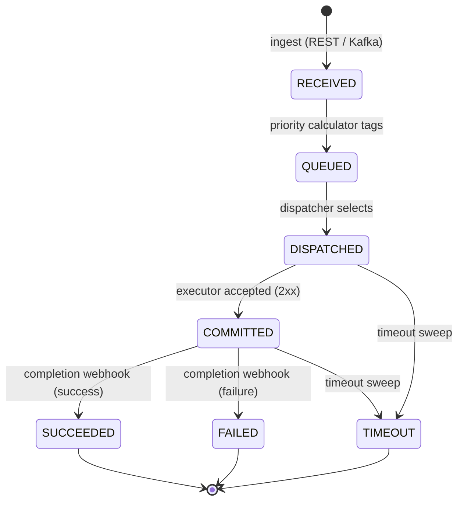

# Task lifecycle

## States

| State | Meaning |
|---|---|
| `RECEIVED` | Persisted, not yet prioritized |
| `QUEUED` | Priority assigned, waiting for dispatch |
| `DISPATCHED` | Selected by the dispatcher, executor not yet confirmed |
| `COMMITTED` | Executor accepted the task (2xx) |
| `SUCCEEDED` | Completion webhook reported success |
| `FAILED` | Completion webhook reported failure |
| `TIMEOUT` | In-flight past `task-timeout-ms` |

## Transitions

- **RECEIVED → QUEUED** — the priority calculator runs every
  `priority-calc-interval` (default 100 ms), tags batches, and promotes starved
  tasks (past `max-queued-time-ms`) to priority 0.
- **QUEUED → DISPATCHED** — the dispatcher selects up to `worker-poll-size` tasks
  per tick (default 50 ms), ordered by priority, honoring per-key quotas and the
  adaptive-RPS budget.
- **DISPATCHED → COMMITTED** — the executor adapter marks the task committed when
  the executor returns 2xx. A declined or failed send leaves the task
  `DISPATCHED` until the timeout sweep.
- **COMMITTED → SUCCEEDED / FAILED** — the completion webhook
  (`POST /api/v1/tasks/{id}/complete`) sets the terminal status and feeds the
  adaptive-RPS controller.
- **DISPATCHED / COMMITTED → TIMEOUT** — the timeout sweep expires in-flight tasks
  past `task-timeout-ms` (default 300 s) and releases their slots.

## Sequential mode

Sequential tasks for one fairness key run strictly in `sequenceNumber` order. The
sequential dispatcher advances a key only when its current task completes; a key
whose task never completes is blocked and recovered by the block-recovery job.
Dependent tasks (`requiresPreviousResult`) wait for their predecessor's result and
fail with `Dependency failed: ...` if the predecessor failed.
